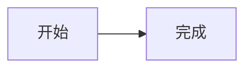

# Nexus

一个基于 **Hugo + PaperMod** 的个人 Markdown 笔记平台。

## 发布到 GitHub Pages

仓库已经配置为 GitHub Pages 自动部署。每次推送到 `main` 分支，工作流会自动构建网站。

## 添加笔记

把任意 `.md` 文件直接放进 `docs/` 或 `docs/notes/`，然后提交并推送即可。例如：

```text
docs/我的新笔记.md
docs/notes/数据结构.md
```

即使没有 front matter，页面也会生成，并使用文件名作为默认标题。推荐使用以下 front matter 添加标题、日期和标签：

```markdown
---
title: "我的新笔记"
date: 2026-08-11
tags:
  - 学习
  - 思考
---

正文内容。
```

> 注意：front matter 的分隔符必须是三条短横线 `---`，不是代码块符号 `````。

### Mermaid 示例

````markdown

````

## 本地预览

安装 Hugo Extended `0.146.0` 或更高版本，并确保已拉取主题子模块：

```powershell
git submodule update --init --recursive
hugo server -D
```

浏览器打开 `http://localhost:1313/`。

## 目录说明

- `docs/`：所有笔记 Markdown 文件；文件可直接放在此处或子目录中
- `hugo.yaml`：站点与 PaperMod 配置
- `assets/css/extended/nexus.css`：Nexus 的文档型视觉系统
- `layouts/`：主页、文章列表、文章详情、归档、Mermaid 渲染等模板
- `.github/workflows/hugo.yml`：GitHub Pages 自动部署
- `themes/PaperMod/`：PaperMod Git 子模块
