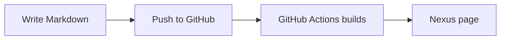

---
title: "Getting Started with Nexus"
date: 2026-08-11T09:00:00+08:00
draft: false
description: "A quick guide to writing and publishing with Markdown"
tags:
  - Nexus
  - Markdown
  - Hugo
categories:
  - Guide
---

Nexus uses Markdown as its source format and GitHub as its publishing entry point.

## Write a new note

Create a Markdown file under `docs/` and add front matter:

```markdown
---
title: "My first note"
date: 2026-08-11
tags: [Reading, Ideas]
categories: [Personal]
---

Your note starts here.
```

Commit and push it to the `main` branch. GitHub Actions will build and publish the site automatically.

## Mermaid diagrams

Use a `mermaid` code block to render a diagram:



## Code blocks

Regular code blocks receive syntax highlighting and a copy button:

```python
from pathlib import Path

notes = list(Path("docs").glob("**/*.md"))
print(f"Found {len(notes)} notes")
```

> Keep one topic per note and add one to three tags to make future searches easier.
